# Module 2: Custom Tools - Architecture

## Overview
This module demonstrates how to extend agent capabilities using custom tools with the @tool decorator and MCP (Model Context Protocol) integration. It includes two exercises: custom tool creation and advanced MCP integration with external services.

## Architecture Diagram

```mermaid
graph TB
    User[👤 User Input] --> Exercise1[📝 Exercise 2<br/>Custom Tools]
    User --> Exercise2[📝 Optional Exercise<br/>MCP Integration]
    
    Exercise1 --> CustomAgent[🤖 Agent with Custom Tools<br/>Built-in + Custom Functions]
    Exercise2 --> MCPAgent[🤖 MCP-Enhanced Agent<br/>External Service Integration]
    
    CustomAgent --> BuiltinTools[📦 Built-in Tools<br/>calculator, current_time]
    CustomAgent --> CustomTools[🛠️ Custom Tools<br/>@tool decorated functions]
    
    MCPAgent --> MCPContext[🔄 Context Manager<br/>with client:]
    MCPContext --> MCPTools[🌐 MCP Tools<br/>External integrations]
    
    BuiltinTools --> ToolExecution1[⚙️ Tool Execution]
    CustomTools --> ToolExecution2[⚙️ Tool Execution]
    MCPTools --> ToolExecution3[⚙️ Tool Execution]
    
    ToolExecution1 --> BedrockModel1[🧠 Bedrock Model<br/>Claude 3.7 Sonnet]
    ToolExecution2 --> BedrockModel2[🧠 Bedrock Model<br/>Claude 3.7 Sonnet]
    ToolExecution3 --> BedrockModel3[🧠 Bedrock Model<br/>Claude 3.7 Sonnet]
    
    MCPContext --> FilesystemServer[📁 Filesystem Server<br/>@modelcontextprotocol/server-filesystem]
    MCPContext --> MemoryServer[🧠 Memory Server<br/>@modelcontextprotocol/server-memory]
    
    FilesystemServer --> NodeJS1[🟢 Node.js Process<br/>npx server]
    MemoryServer --> NodeJS2[🟢 Node.js Process<br/>npx server]
    
    BedrockModel1 --> AWSBedrock1[☁️ AWS Bedrock]
    BedrockModel2 --> AWSBedrock2[☁️ AWS Bedrock]
    BedrockModel3 --> AWSBedrock3[☁️ AWS Bedrock]
    
    AWSBedrock1 --> Response1[📄 Enhanced Response]
    AWSBedrock2 --> Response2[📄 Enhanced Response]
    AWSBedrock3 --> Response3[📄 Enhanced Response]
    
    Response1 --> InteractiveMode[🎮 Interactive Mode<br/>Continuous Testing]
    Response2 --> TestScenarios[🧪 Test Scenarios<br/>Predefined Tasks]
    Response3 --> CustomWorkflow[🚀 Custom Workflow<br/>Student Implementation]
    
    subgraph "Workshop Exercises"
        Exercise1
        Exercise2
    end
    
    subgraph "Tool Categories"
        BuiltinTools
        CustomTools
        MCPTools
    end
    
    subgraph "MCP Infrastructure"
        FilesystemServer
        MemoryServer
        NodeJS1
        NodeJS2
    end
    
    subgraph "Model Infrastructure"
        BedrockModel1
        BedrockModel2
        BedrockModel3
        AWSBedrock1
        AWSBedrock2
        AWSBedrock3
    end
    
    style User fill:#e1f5fe
    style Exercise1 fill:#f3e5f5
    style Exercise2 fill:#e8f5e8
    style CustomTools fill:#fff3e0
    style MCPTools fill:#fce4ec
    style MCPContext fill:#e3f2fd
    style InteractiveMode fill:#f1f8e9
```



## Workshop Exercises

### Exercise 2: Custom Tools (exercise2-custom-tools.py)
```python
#!/usr/bin/env python3
"""
Module 2: Custom Tools - Extending Agent Capabilities
Based on official Strands SDK documentation
"""

from strands import Agent, tool
from strands_tools import calculator, current_time

@tool
def letter_counter(word: str, letter: str) -> int:
    """
    Count occurrences of a specific letter in a word.
    
    Args:
        word (str): The input word to search in
        letter (str): The specific letter to count
        
    Returns:
        int: The number of occurrences of the letter in the word
    """
    # Input validation
    if not isinstance(word, str) or not isinstance(letter, str):
        return 0
    if len(letter) != 1:
        raise ValueError("The 'letter' parameter must be a single character")
    
    return word.lower().count(letter.lower())

@tool
def text_reverser(text: str) -> str:
    """
    Reverse the order of characters in text.
    
    Args:
        text (str): Text to reverse
        
    Returns:
        str: Reversed text
    """
    if not isinstance(text, str):
        return "Error: Input must be a string"
    
    return text[::-1]

@tool
def word_counter(text: str) -> int:
    """
    Count the number of words in text.
    
    Args:
        text (str): Text to count words in
        
    Returns:
        int: Number of words
    """
    if not isinstance(text, str):
        return 0
    
    words = text.strip().split()
    return len(words)

def main():
    """Demonstrate custom tools with Strands agent."""
    print("🛠️  Custom Tools Demo")
    print("="*50)
    
    # Create agent with both built-in and custom tools
    agent = Agent(tools=[
        calculator,           # Built-in tool
        current_time,        # Built-in tool
        letter_counter,      # Custom tool
        text_reverser,       # Custom tool
        word_counter         # Custom tool
    ])
    
    # Show available tools
    print("Available tools:")
    for tool_name in agent.tool_names:
        print(f"  • {tool_name}")
```

**Key Features:**
- **Custom Tool Creation**: Three custom tools with `@tool` decorator
- **Built-in Tool Integration**: Uses `calculator` and `current_time`
- **Input Validation**: Comprehensive error handling in tools
- **Interactive Testing**: Predefined scenarios + interactive mode
- **Tool Discovery**: Shows available tools via `agent.tool_names`

### Optional Exercise: MCP Integration (optional-module2-mcp-integration.py)
```python
#!/usr/bin/env python3
"""
Module 2 Exercise: Build Your Own MCP-Enabled Agent (FIXED VERSION)

KEY FIX: Proper MCP client context manager usage - the agent must be created
and used WITHIN the client context manager.
"""

from mcp import stdio_client, StdioServerParameters
from strands import Agent
from strands.tools.mcp import MCPClient
from strands.models import BedrockModel

class StudentMCPAgent:
    """Student exercise: Build an MCP-enabled agent - FIXED VERSION."""
    
    def __init__(self):
        self.model = BedrockModel(
            model_id="us.anthropic.claude-3-7-sonnet-20250219-v1:0",
            temperature=0.3
        )
    
    def exercise_1_file_operations(self):
        """Exercise 1: Basic file operations with MCP - FIXED VERSION."""
        current_dir = str(Path.cwd())
        
        # Create MCPClient for filesystem server
        client = MCPClient(lambda: stdio_client(
            StdioServerParameters(
                command="npx",
                args=["-y", "@modelcontextprotocol/server-filesystem", current_dir]
            )
        ))
        
        # CRITICAL FIX: Use agent WITHIN the client context manager
        with client:
            # Get tools and create agent INSIDE the context manager
            tools = client.list_tools_sync()
            
            agent = Agent(
                model=self.model,
                tools=tools,
                system_prompt="You are a filesystem assistant with file operation capabilities."
            )
            
            tasks = [
                "List all .py files in the current directory",
                "Create a new file called 'student_notes.txt' with your learning notes about MCP",
                "Read the content of the file you just created"
            ]
            
            for i, task in enumerate(tasks, 1):
                print(f"\n📝 Task {i}: {task}")
                try:
                    response = agent(task)
                    print(f"✅ Result: {response}")
                except Exception as e:
                    print(f"❌ Error: {e}")
```

**Key Features:**
- **MCP Context Manager**: Proper lifecycle management with `with client:`
- **External Service Integration**: Node.js-based MCP servers
- **Student Exercise Structure**: TODO-driven learning approach
- **Multiple MCP Servers**: Filesystem and Memory operations
- **Error Handling**: Comprehensive exception management

## Tool Development Patterns

### Custom Tool Creation with @tool Decorator
```python
@tool
def custom_function(param1: str, param2: int) -> str:
    """
    Clear description for LLM tool selection.
    
    Args:
        param1 (str): Description of first parameter
        param2 (int): Description of second parameter
        
    Returns:
        str: Description of return value
    """
    # Input validation
    if not isinstance(param1, str):
        return "Error: param1 must be a string"
    
    # Implementation
    result = f"Processed: {param1} with value {param2}"
    return result
```

**Best Practices:**
1. **Comprehensive Docstrings**: LLM uses these for tool selection
2. **Type Hints**: Enable parameter validation and IDE support
3. **Input Validation**: Check types and values before processing
4. **Error Handling**: Return descriptive error messages
5. **Single Responsibility**: One tool, one specific function

### Built-in Tool Integration
```python
from strands_tools import calculator, current_time

# Mathematical operations
result = calculator("15 * 23 + 47")

# Real-time information
now = current_time()

# Agent with built-in tools
agent = Agent(tools=[calculator, current_time])
```

**Available Built-in Tools:**
- **calculator**: Mathematical computations and expressions
- **current_time**: Real-time clock information with timezone support

## MCP Integration Architecture

### Critical Context Manager Pattern
```python
# ❌ WRONG WAY:
client = MCPClient(...)
tools = client.list_tools_sync()  # Outside context manager
agent = Agent(tools=tools)        # Outside context manager
with client:
    response = agent("task")       # Agent created outside, used inside

# ✅ CORRECT WAY:
client = MCPClient(...)
with client:                      # Context manager first
    tools = client.list_tools_sync()  # Inside context manager
    agent = Agent(tools=tools)        # Inside context manager
    response = agent("task")           # Everything inside
```

**Why This Matters:**
- MCP tools need an active client session to work
- Context manager manages client session lifecycle
- Creating agents outside breaks the connection
- Common cause of `MCPClientInitializationError`

### MCP Server Configurations

#### Filesystem Server
```python
current_dir = str(Path.cwd())

client = MCPClient(lambda: stdio_client(
    StdioServerParameters(
        command="npx",
        args=["-y", "@modelcontextprotocol/server-filesystem", current_dir]
    )
))
```

**Capabilities:**
- File listing and directory navigation
- File creation, reading, and modification
- File system operations within specified directory
- Secure sandboxed access

#### Memory Server
```python
client = MCPClient(lambda: stdio_client(
    StdioServerParameters(
        command="npx",
        args=["-y", "@modelcontextprotocol/server-memory"]
    )
))
```

**Capabilities:**
- Persistent memory storage across sessions
- Information retrieval and search
- Context maintenance for conversations
- Knowledge base functionality

### Installation Requirements

#### Core Dependencies
```bash
# Core Strands SDK
pip install strands-agents
pip install strands-agents-tools

# MCP support
pip install mcp[cli]
```

#### MCP Server Setup
```bash
# Install Node.js (required for MCP servers)
# Then install MCP servers:
npm install -g @modelcontextprotocol/server-filesystem
npm install -g @modelcontextprotocol/server-memory

# Verify installation
npx @modelcontextprotocol/server-filesystem --help
npx @modelcontextprotocol/server-memory --help
```

## Interactive Testing Patterns

### Predefined Test Scenarios
```python
test_requests = [
    "What time is it right now, in Sydney?",
    "Calculate 15 * 23 + 47",
    "How many letter 'r's are in the word 'strawberry'?",
    "Reverse the text 'Hello World'",
    "How many words are in this sentence: 'The quick brown fox jumps over the lazy dog'?"
]

for i, request in enumerate(test_requests, 1):
    print(f"\n{i}. 📝 Request: {request}")
    try:
        response = agent(request)
        print(f"   🤖 Response: {response}")
    except Exception as e:
        print(f"   ❌ Error: {e}")
```

### Interactive Mode Implementation
```python
print("🎮 Interactive Mode - Try your own questions!")
print("Type 'quit' to exit")

while True:
    try:
        user_input = input("\n💬 You: ").strip()
        
        if user_input.lower() in ['quit', 'exit', 'q']:
            print("👋 Goodbye!")
            break
        
        if not user_input:
            continue
            
        response = agent(user_input)
        print(f"🤖 Agent: {response}")
        
    except KeyboardInterrupt:
        print("\n👋 Goodbye!")
        break
    except Exception as e:
        print(f"❌ Error: {e}")
```

## Data Flow Patterns

### Exercise 2 Flow (Custom Tools)
1. **Tool Definition** → Custom functions with `@tool` decorator
2. **Agent Creation** → Combine built-in and custom tools
3. **Tool Discovery** → Display available capabilities
4. **Scenario Testing** → Predefined test cases
5. **Interactive Mode** → User-driven exploration

### MCP Exercise Flow
1. **Environment Check** → Verify Node.js and MCP servers
2. **Client Creation** → Initialize MCP client with server parameters
3. **Context Management** → Enter client context manager
4. **Tool Retrieval** → Get tools from MCP server
5. **Agent Creation** → Create agent within context
6. **Task Execution** → Execute workflow tasks
7. **Cleanup** → Automatic context manager cleanup

## Error Handling Strategies

### Tool-Level Error Handling
```python
@tool
def safe_tool(input_data: str) -> str:
    """Tool with comprehensive error handling."""
    try:
        # Input validation
        if not isinstance(input_data, str):
            return "Error: Input must be a string"
        
        if not input_data.strip():
            return "Error: Input cannot be empty"
        
        # Tool logic
        result = process_data(input_data)
        return result
        
    except ValueError as e:
        return f"Input validation error: {e}"
    except Exception as e:
        return f"Tool execution error: {e}"
```

### MCP Connection Error Handling
```python
def check_student_setup():
    """Check if student environment is ready."""
    import subprocess
    
    # Check Node.js
    try:
        result = subprocess.run(["node", "--version"], capture_output=True, text=True)
        if result.returncode == 0:
            print(f"✅ Node.js: {result.stdout.strip()}")
        else:
            print("❌ Node.js not found")
            return False
    except FileNotFoundError:
        print("❌ Node.js not installed")
        return False
    
    # Check MCP servers
    try:
        result = subprocess.run(
            ["npx", "-y", "@modelcontextprotocol/server-filesystem", "."],
            capture_output=True, timeout=3, text=True
        )
        print("✅ MCP filesystem server available")
    except subprocess.TimeoutExpired:
        print("✅ MCP filesystem server available")
    except Exception as e:
        print(f"❌ MCP filesystem server not working: {e}")
        return False
```

### Agent-Level Error Handling
```python
try:
    response = agent(task)
    print(f"✅ Result: {response}")
except Exception as e:
    print(f"❌ Error: {e}")
    print("💡 Check your tool implementation and try again")
```

## Performance Considerations

### Tool Execution Optimization
- **Lazy Loading**: Tools loaded only when needed
- **Caching**: Cache expensive computations in tools
- **Validation**: Early input validation to prevent processing
- **Timeout Management**: Prevent hung tool executions

### MCP Connection Management
- **Context Lifecycle**: Proper connection management via context managers
- **Connection Pooling**: Reuse connections when possible
- **Resource Cleanup**: Automatic cleanup via context managers
- **Error Recovery**: Graceful degradation on connection failures

## Security Considerations

### Tool Security
- **Input Sanitization**: Validate all tool inputs
- **Sandboxing**: Tools run in isolated contexts
- **Permission Limitation**: Minimal required permissions
- **Output Validation**: Sanitize tool outputs

### MCP Security
- **Process Isolation**: MCP servers run in separate Node.js processes
- **Directory Restrictions**: Filesystem server limited to specified directories
- **No Network Access**: Memory server operates locally
- **Secure Communication**: Stdio-based communication protocol

## Educational Features

### Progressive Learning Structure
1. **Built-in Tools**: Start with pre-built capabilities
2. **Custom Tools**: Learn `@tool` decorator patterns
3. **Input Validation**: Understand robust tool development
4. **MCP Integration**: Advanced external service integration
5. **Context Management**: Master MCP lifecycle patterns

### Student Exercise Patterns
```python
# TODO-driven learning
# TODO 1: Initialize the Bedrock model
# TODO 2: Create MCPClient for filesystem server
# TODO 3: Get tools and create agent INSIDE the context manager

# Guided implementation with solutions
self.model = BedrockModel(
    model_id="us.anthropic.claude-3-7-sonnet-20250219-v1:0",
    temperature=0.3
)  # SOLUTION PROVIDED - Replace with your implementation
```

### Interactive Feedback System
- Real-time tool testing with immediate results
- Error messages with actionable guidance
- Progress tracking across exercises
- Capability demonstrations before user interaction

## Future Extensions

### Advanced Tool Patterns
- **Async Tools**: Non-blocking tool execution
- **Tool Composition**: Combining multiple tools in workflows
- **Dynamic Tools**: Runtime tool generation
- **Tool Monitoring**: Performance and usage tracking

### Extended MCP Integration
- **Custom MCP Servers**: Student-built MCP services
- **Database Integration**: SQL query MCP servers
- **API Integration**: REST/GraphQL MCP connectors
- **Workflow Engines**: Complex multi-step MCP workflows

### Workshop Progression
Module 2 builds foundation for:
- **Module 3**: Multi-agent tool coordination
- **Module 4**: Production tool resilience
- **Module 5**: A2A protocol tool sharing
- **Module 6**: Serverless tool deployment