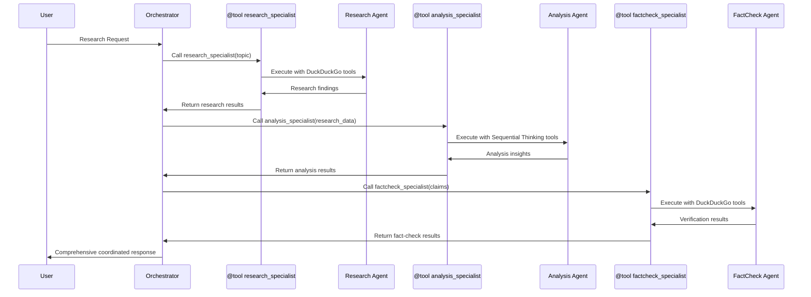

# Module 3: Multi-Agent Research Team - Architecture

## Overview
This module demonstrates real multi-agent coordination using the **agents-as-tools pattern** with MCP integration, where specialist agents are wrapped as tools and coordinated by an orchestrator agent. This represents true multi-agent collaboration rather than simple sequential workflows.

## Architecture Diagram

```mermaid
graph TB
    User[👤 User Research Request] --> ResearchTeam[🎯 ResearchTeam Class<br/>Agents-as-Tools Coordinator]
    ResearchTeam --> MCPSetup[🌐 MCP Client Setup<br/>DuckDuckGo + Sequential Thinking]
    
    MCPSetup --> ContextManager[🔄 Context Manager<br/>ExitStack with MCP Clients]
    ContextManager --> OrchestratorCreation[🎯 Orchestrator Creation<br/>_create_orchestrator_with_mcp()]
    
    OrchestratorCreation --> Orchestrator[🤖 Orchestrator Agent<br/>ResearchOrchestrator]
    Orchestrator --> SpecialistTools[🛠️ Specialist Agent Tools<br/>@tool wrapped agents]
    
    SpecialistTools --> ResearchTool[🔍 @tool research_specialist<br/>Web Research via DuckDuckGo]
    SpecialistTools --> AnalysisTool[📊 @tool analysis_specialist<br/>Sequential Thinking Analysis]
    SpecialistTools --> FactCheckTool[✅ @tool factcheck_specialist<br/>Fact Verification via DuckDuckGo]
    SpecialistTools --> QualityTool[🏆 @tool quality_specialist<br/>Quality Assessment]
    
    ResearchTool --> ResearchAgent[🔬 Research Agent<br/>ResearchSpecialist]
    AnalysisTool --> AnalysisAgent[📈 Analysis Agent<br/>AnalysisSpecialist]
    FactCheckTool --> FactCheckAgent[🔍 Fact-Check Agent<br/>FactCheckSpecialist]
    QualityTool --> QualityAgent[⭐ Quality Agent<br/>QualityAssuranceSpecialist]
    
    ResearchAgent --> DuckDuckGoTools1[🌐 DuckDuckGo MCP Tools<br/>Web Search Capabilities]
    AnalysisAgent --> SequentialTools1[🧠 Sequential Thinking Tools<br/>Structured Reasoning]
    FactCheckAgent --> DuckDuckGoTools2[🌐 DuckDuckGo MCP Tools<br/>Verification Search]
    QualityAgent --> CombinedTools[🔧 Combined Tools<br/>Sequential + DuckDuckGo]
    
    DuckDuckGoTools1 --> MCPDuckDuckGo[🐳 MCP DuckDuckGo Server<br/>Docker Container]
    SequentialTools1 --> MCPSequential[🐳 MCP Sequential Server<br/>Docker Container]
    DuckDuckGoTools2 --> MCPDuckDuckGo
    CombinedTools --> MCPDuckDuckGo
    CombinedTools --> MCPSequential
    
    MCPDuckDuckGo --> WebSearchResults[🔍 Real Web Search Results]
    MCPSequential --> StructuredAnalysis[🧠 Structured Reasoning Output]
    
    WebSearchResults --> AgentOutputs[📄 Specialist Agent Outputs]
    StructuredAnalysis --> AgentOutputs
    
    AgentOutputs --> Orchestrator
    Orchestrator --> BedrockModel[🧠 Bedrock Model<br/>Claude 3.7 Sonnet]
    BedrockModel --> AWSBedrock[☁️ AWS Bedrock<br/>us.anthropic.claude-3-7-sonnet-20250219-v1:0]
    
    AWSBedrock --> ResearchResult[📋 ResearchResult<br/>Comprehensive Report]
    ResearchResult --> PerformanceMetrics[📊 Performance Metrics<br/>Quality Scores & Execution Time]
    
    ResearchResult --> User
    PerformanceMetrics --> User
    
    subgraph "Agents-as-Tools Pattern"
        ResearchTool
        AnalysisTool
        FactCheckTool
        QualityTool
    end
    
    subgraph "Specialist Agents"
        ResearchAgent
        AnalysisAgent
        FactCheckAgent
        QualityAgent
    end
    
    subgraph "MCP Infrastructure"
        MCPDuckDuckGo
        MCPSequential
        DuckDuckGoTools1
        SequentialTools1
        DuckDuckGoTools2
        CombinedTools
    end
    
    subgraph "Context Management"
        ContextManager
        MCPSetup
    end
    
    style User fill:#e1f5fe
    style ResearchTeam fill:#f3e5f5
    style Orchestrator fill:#e8f5e8
    style ResearchTool fill:#fff3e0
    style AnalysisTool fill:#fce4ec
    style FactCheckTool fill:#e3f2fd
    style QualityTool fill:#f1f8e9
    style ContextManager fill:#f9fbe7
    style MCPSetup fill:#fff8e1
```

## Workshop Exercise

### Exercise 3: Research Team (exercise3-research-team.py)
```python
# Exercise 3: REAL Research Team - Multi-Agent Orchestration (AGENTS-AS-TOOLS PATTERN)
# Arc II: Multi-Agent Orchestration - using Strands SDK patterns

"""
🎯 LEARNING OBJECTIVES:
1. Implement agents-as-tools pattern for multi-agent coordination
2. Create specialized agents that agents can call as tools using @tool decorator
3. Build intelligent task routing where agents invoke other agents
4. Handle production-grade agent-to-agent communication with MCP tools

🏗️ ARCHITECTURE OVERVIEW (Agents-as-Tools Pattern):
- Orchestrator Agent: Uses specialized agent tools for coordination
- @tool wrapped agents: Researcher, Analyst, Fact Checker, QA Specialist
- Agent-to-agent communication: Orchestrator calls agents as tools
- True data flow: Each agent builds on previous agent's actual output
- Production coordination: Agents deciding which other agents to invoke
- MCP Integration: Uses DuckDuckGo search and Sequential Thinking tools
"""

from strands import Agent, tool
from strands.models import BedrockModel
from strands.tools.mcp import MCPClient
from mcp import stdio_client, StdioServerParameters
from typing import Dict, Any, List
import time
from dataclasses import dataclass, field
from enum import Enum
import logging

class TaskComplexity(Enum):
    """Real complexity levels based on actual research requirements."""
    SIMPLE = "simple"      # Single source verification, 1-2 agents
    STANDARD = "standard"  # Multi-source research, 2-3 agents  
    COMPLEX = "complex"    # Cross-verification, all agents
    EXPERT = "expert"      # Deep analysis with fact-checking, all agents + validation

@dataclass
class ResearchResult:
    """Comprehensive result from real multi-agent research."""
    topic: str
    complexity: TaskComplexity
    research_summary: str
    sources_found: List[str]
    web_requests_made: int
    execution_time: float
    agents_utilized: List[str]
    quality_score: float
    metadata: Dict[str, Any] = field(default_factory=dict)
```

**Key Features:**
- **Agents-as-Tools Pattern**: Specialist agents wrapped with `@tool` decorator
- **Real Multi-Agent Coordination**: Orchestrator intelligently routes tasks
- **MCP Integration**: External services via Docker containers
- **Performance Tracking**: Comprehensive metrics and quality scoring
- **Context Management**: Proper MCP client lifecycle handling

## Key Components

### 1. MCP Client Setup
```python
def setup_mcp_clients():
    """Setup MCP clients for DuckDuckGo search and Sequential Thinking tools."""
    try:
        # DuckDuckGo MCP Client
        duckduckgo_client = MCPClient(lambda: stdio_client(
            StdioServerParameters(
                command="docker",
                args=["run", "-i", "--rm", "mcp/duckduckgo"]
            )
        ))
        
        # Sequential Thinking MCP Client  
        sequential_thinking_client = MCPClient(lambda: stdio_client(
            StdioServerParameters(
                command="docker",
                args=["run", "-i", "--rm", "mcp/sequentialthinking"]
            )
        ))
        
        return duckduckgo_client, sequential_thinking_client
        
    except Exception as e:
        logger.error(f"Failed to setup MCP clients: {e}")
        return None, None
```

**Features:**
- **Docker Integration**: MCP servers run in isolated containers
- **Error Handling**: Graceful fallback when MCP unavailable
- **Multiple Clients**: Support for different MCP service types

### 2. Specialist Agent Creation
```python
def create_specialized_agents():
    """Create specialized agents that will be wrapped as tools."""
    model = BedrockModel(
        model_id="us.anthropic.claude-3-7-sonnet-20250219-v1:0",
        temperature=0.3
    )
    
    # Specialized Research Agent with DuckDuckGo search
    research_agent = Agent(
        name="ResearchSpecialist",
        model=model,
        system_prompt="""You are a specialized Research Agent who performs ACTUAL web research.

Your expertise:
1. Search the web using DuckDuckGo search tools for real information
2. Extract factual information from search results
3. Provide comprehensive research findings with source attribution
4. Handle search errors gracefully with fallback responses

Use the DuckDuckGo search tools to find current, accurate information on any topic.
Always provide source attribution and verify information quality.""",
        tools=duckduckgo_tools
    )
    
    # Specialized Analysis Agent with Sequential Thinking
    analysis_agent = Agent(
        name="AnalysisSpecialist", 
        model=model,
        system_prompt="""You are a specialized Analysis Agent who processes research data.

Your expertise:
1. Analyze research findings and identify key patterns using sequential thinking
2. Extract insights and synthesize information systematically
3. Use structured reasoning to break down complex problems
4. Generate comprehensive analytical reports

Use sequential thinking tools to work through complex analysis step by step.""",
        tools=sequential_thinking_tools
    )
    
    return research_agent, analysis_agent, factcheck_agent, qa_agent
```

**Agent Specializations:**
- **ResearchSpecialist**: Web research with DuckDuckGo MCP tools
- **AnalysisSpecialist**: Structured analysis with Sequential Thinking tools
- **FactCheckSpecialist**: Verification using DuckDuckGo search
- **QualityAssuranceSpecialist**: Assessment with combined tool sets

### 3. Agents-as-Tools Pattern Implementation
```python
class ResearchTeam:
    """
    🎯 Multi-Agent Research Team using Agents-as-Tools Pattern with MCP
    
    This implements TRUE multi-agent coordination where:
    - Orchestrator agent uses specialist agents as tools
    - Each specialist agent performs actual work (web search, analysis, etc.)
    - Real agent-to-agent communication and data flow
    - Intelligent routing based on query requirements
    - MCP integration for real web search and advanced reasoning
    """
    
    def _create_orchestrator_with_mcp(self):
        """Create orchestrator agent that uses specialist agents as tools within MCP context."""
        
        # Create specialized agents (will be done within MCP context)
        research_agent, analysis_agent, factcheck_agent, qa_agent = create_specialized_agents()
        
        # Create @tool wrapped functions for each specialist agent
        @tool
        def research_specialist(topic: str) -> str:
            """
            Perform comprehensive web research using DuckDuckGo search.
            
            Args:
                topic (str): The research topic to investigate
                
            Returns:
                str: Comprehensive research findings with source attribution
            """
            try:
                logger.info(f"🔍 Research Specialist: Investigating '{topic}'")
                result = research_agent(
                    f"Research the topic: '{topic}'. "
                    f"Use DuckDuckGo search to find current, accurate information. "
                    f"Provide detailed findings with proper source attribution."
                )
                return str(result)
            except Exception as e:
                logger.error(f"Research specialist error: {e}")
                return f"Research error: {str(e)}"

        @tool
        def analysis_specialist(research_data: str) -> str:
            """
            Analyze research data using sequential thinking approach.
            
            Args:
                research_data (str): Research findings to analyze
                
            Returns:
                str: Detailed analysis with insights and patterns
            """
            try:
                logger.info("📊 Analysis Specialist: Processing research data")
                result = analysis_agent(
                    f"Analyze this research data using sequential thinking: {research_data}. "
                    f"Break down the analysis step by step and extract key insights."
                )
                return str(result)
            except Exception as e:
                logger.error(f"Analysis specialist error: {e}")
                return f"Analysis error: {str(e)}"
        
        # 🎯 Orchestrator Agent with Specialist Agents as Tools
        orchestrator = Agent(
            name="ResearchOrchestrator",
            model=self.model,
            system_prompt="""You are a Research Orchestrator managing a team of specialist agents.

You have access to these specialist agent tools:
- research_specialist: Performs web research using DuckDuckGo search
- analysis_specialist: Analyzes research data using sequential thinking  
- factcheck_specialist: Fact-checks claims using DuckDuckGo search
- quality_specialist: Assesses research quality and completeness

Your coordination strategy:
1. For any research request, use research_specialist to gather information via web search
2. Use analysis_specialist to process and synthesize the research data systematically
3. For complex topics, use factcheck_specialist to verify key claims via web search
4. Use quality_specialist to ensure research meets high standards
5. Coordinate intelligently based on the complexity and requirements

This is REAL multi-agent coordination - you are calling actual specialist agents
that will perform real work (web search, systematic analysis, fact-checking).
Route queries appropriately and build comprehensive responses.""",
            tools=[research_specialist, analysis_specialist, factcheck_specialist, quality_specialist]
        )
        
        return orchestrator
```

**Pattern Benefits:**
- **True Coordination**: Orchestrator makes intelligent routing decisions
- **Real Communication**: Actual data flows between specialist agents
- **Tool Abstraction**: Specialist agents accessible as callable tools
- **Error Isolation**: Individual agent failures don't break entire system

## Multi-Agent Coordination Flow

### Context Management and Execution
```python
def conduct_real_research(self, topic: str, complexity: TaskComplexity = TaskComplexity.STANDARD) -> ResearchResult:
    """
    🚀 Conduct REAL research using agents-as-tools pattern with MCP integration.
    
    This is TRUE multi-agent coordination where the orchestrator agent
    intelligently calls specialist agents as tools based on the research requirements.
    Each specialist agent performs actual work using MCP tools and builds on previous agents' outputs.
    """
    # ===== MCP CONTEXT MANAGEMENT =====
    # All MCP operations must be within context managers
    
    if not self.mcp_clients:
        logger.warning("No MCP clients available, using agents without MCP tools")
        orchestrator = self._create_orchestrator_with_mcp()
        research_instruction = self._create_research_instruction(topic, complexity)
        result_summary = orchestrator(research_instruction)
    else:
        # Use MCP clients within context managers
        from contextlib import ExitStack
        
        with ExitStack() as stack:
            # Enter all MCP client contexts
            for client in self.mcp_clients:
                if client:
                    stack.enter_context(client)
            
            # Create orchestrator with MCP-enabled specialist agents
            orchestrator = self._create_orchestrator_with_mcp()
            
            # Create research instruction
            research_instruction = self._create_research_instruction(topic, complexity)
            
            # ===== ORCHESTRATOR COORDINATES REAL AGENTS WITH MCP =====
            # This is where the REAL multi-agent magic happens with MCP tools!
            result_summary = orchestrator(research_instruction)
```

### Task Complexity Coordination
```python
def _create_research_instruction(self, topic: str, complexity: TaskComplexity) -> str:
    """Create research instruction for the orchestrator."""
    return f"""
    Conduct comprehensive research on: '{topic}' with {complexity.value} complexity.
    
    You have access to specialist agent tools that perform REAL work with MCP integration:
    
    - research_specialist: Uses DuckDuckGo search to gather current information
    - analysis_specialist: Uses sequential thinking for systematic analysis
    - factcheck_specialist: Uses DuckDuckGo search to verify claims
    - quality_specialist: Assesses research quality and completeness
    
    Coordination strategy based on complexity:
    - SIMPLE: Use research_specialist only
    - STANDARD: Use research_specialist + analysis_specialist
    - COMPLEX: Use research_specialist + analysis_specialist + factcheck_specialist  
    - EXPERT: Use all specialist agents for comprehensive research
    
    The specialist agents will perform actual work with MCP tools:
    - Real web searches using DuckDuckGo MCP integration
    - Systematic analysis using sequential thinking MCP tools
    - Genuine fact-checking against multiple web sources
    - Real quality assessment with comprehensive metrics
    
    Coordinate intelligently and build comprehensive findings from the specialist agents' work.
    Each agent's output becomes input for the next agent in your coordination strategy.
    """
```

## Data Flow Patterns

### Agents-as-Tools vs Sequential Workflow


### Performance Metrics and Quality Assessment
```python
def get_real_performance_metrics(self) -> Dict[str, Any]:
    """Generate REAL performance metrics from agents-as-tools operations with MCP integration."""
    return {
        'total_requests': self.execution_metrics['total_requests'],
        'success_rate': success_rate,
        'avg_execution_time': avg_execution_time,
        'avg_quality_score': avg_quality_score,
        'agent_coordination_calls': self.execution_metrics['agent_calls'],
        'coordination_pattern': 'agents-as-tools-with-mcp',
        'mcp_integration': True,
        'mcp_clients_available': len(self.mcp_clients),
        'research_type': 'AGENTS_AS_TOOLS_WITH_MCP_INTEGRATION',
        'capabilities': [
            'Real multi-agent coordination using @tool pattern',
            'Specialist agents as callable tools',
            'Intelligent agent routing by orchestrator',
            'MCP integration for web search (DuckDuckGo)',
            'Sequential thinking tools for systematic analysis',
            'True agent-to-agent communication and data flow',
            'Production-grade multi-agent orchestration with MCP',
            'Real web search capabilities via MCP tools',
            'Advanced reasoning with sequential thinking MCP'
        ]
    }
```

## Educational Comparison

### Testing Pattern Understanding
```python
def test_agents_as_tools_pattern():
    """
    🧪 Test to demonstrate the agents-as-tools pattern vs sequential workflow
    """
    print("🧪 AGENTS-AS-TOOLS vs SEQUENTIAL WORKFLOW COMPARISON")
    print("=" * 70)
    
    print("\n❌ SEQUENTIAL WORKFLOW (Not Real Multi-Agent):")
    print("• Agent A runs → Agent B runs → Agent C runs")
    print("• Each agent ignores previous agent outputs")
    print("• No intelligent coordination or routing")
    print("• Just workflow steps, not agent collaboration")
    
    print("\n✅ AGENTS-AS-TOOLS PATTERN (Real Multi-Agent):")
    print("• Orchestrator agent uses specialist agents as tools")
    print("• @tool decorator wraps agents as callable functions") 
    print("• Orchestrator intelligently routes to appropriate specialists")
    print("• Each specialist agent's output becomes input to next agent")
    print("• Real agent-to-agent communication and data flow")
    print("• MCP integration provides real web search and reasoning tools")
```

## Error Handling & Resilience

### Agent-Level Error Handling
```python
@tool
def research_specialist(topic: str) -> str:
    try:
        result = research_agent(f"Research the topic: '{topic}'...")
        return str(result)
    except Exception as e:
        logger.error(f"Research specialist error: {e}")
        return f"Research error: {str(e)}"
```

### MCP Connection Management
```python
# Use all available MCP clients in context
if not self.mcp_clients:
    logger.warning("No MCP clients available, using agents without MCP tools")
    # Fallback to basic agent coordination
else:
    # Full MCP integration with proper context management
    with ExitStack() as stack:
        for client in self.mcp_clients:
            if client:
                stack.enter_context(client)
```

### Result Validation
```python
# Extract agent utilization from orchestrator's coordination
result_str = str(result_summary)
agents_used = []
if "research_specialist" in result_str.lower():
    agents_used.append("research_specialist")
if "analysis_specialist" in result_str.lower():
    agents_used.append("analysis_specialist") 
# ... check for other specialists

# Create comprehensive result with metadata
result = ResearchResult(
    topic=topic,
    complexity=complexity,
    research_summary=result_str,
    agents_utilized=['orchestrator'] + agents_used,
    metadata={
        'coordination_pattern': 'agents-as-tools-with-mcp',
        'specialist_agents_called': agents_used,
        'real_multi_agent': True,
        'mcp_integration': True,
        'research_type': 'AGENTS_AS_TOOLS_WITH_MCP'
    }
)
```

## Installation Requirements

### Core Dependencies
```bash
# Core Strands SDK
pip install strands-agents
pip install strands-agents-tools

# MCP support
pip install mcp[cli]
```

### MCP Server Setup
```bash
# Docker required for MCP servers
docker pull mcp/duckduckgo
docker pull mcp/sequentialthinking

# Verify MCP containers work
docker run --rm mcp/duckduckgo --help
docker run --rm mcp/sequentialthinking --help
```

## Performance Characteristics

### Execution Metrics
- **Multi-Agent Coordination**: True agent-to-agent communication
- **MCP Integration**: Real external service calls via Docker
- **Quality Scoring**: Based on complexity and execution success
- **Agent Utilization**: Tracking which specialists are called

### Scalability Considerations
- **Context Management**: Proper MCP client lifecycle handling
- **Error Isolation**: Individual agent failures contained
- **Resource Usage**: Docker containers for MCP services
- **Coordination Efficiency**: Intelligent routing reduces unnecessary calls

## Security Considerations

### Agent Isolation
- Each specialist agent runs with specific system prompts
- MCP servers isolated in Docker containers
- Error handling prevents information leakage

### MCP Security
- Docker container isolation for external services
- Controlled access to web search capabilities
- No persistent storage of sensitive data

## Future Extensions

### Advanced Coordination Patterns
- **Dynamic Agent Loading**: Runtime specialist discovery
- **Cross-Agent Memory**: Shared context between specialists
- **Hierarchical Coordination**: Multi-level orchestrator patterns
- **Adaptive Routing**: Learning-based agent selection

### Enhanced MCP Integration
- **Custom MCP Servers**: Domain-specific tool integration
- **Streaming Results**: Real-time coordination feedback
- **Distributed MCP**: Multi-host specialist deployment
- **Advanced Tool Chaining**: Complex multi-step workflows

### Workshop Progression
Module 3 establishes multi-agent foundations for:
- **Module 4**: Production resilience and fallback patterns
- **Module 5**: A2A protocol for distributed agent systems
- **Module 6**: Serverless deployment of multi-agent systems